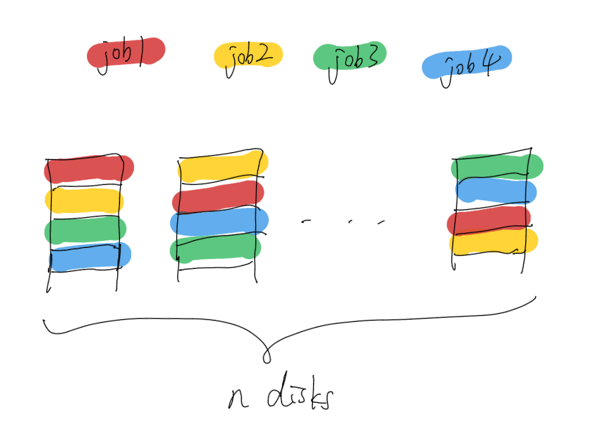
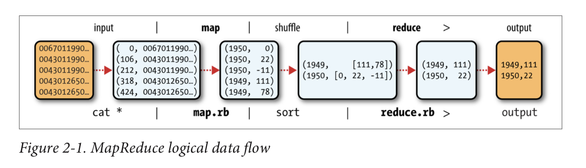
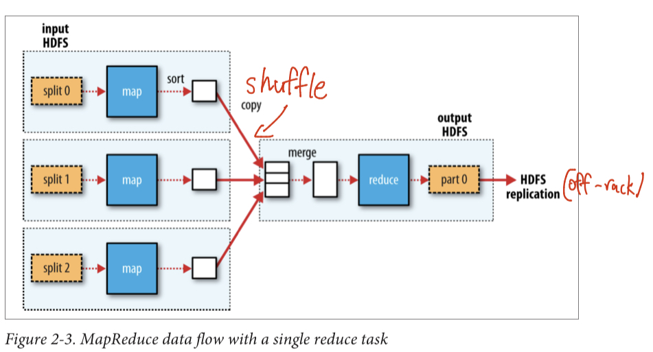
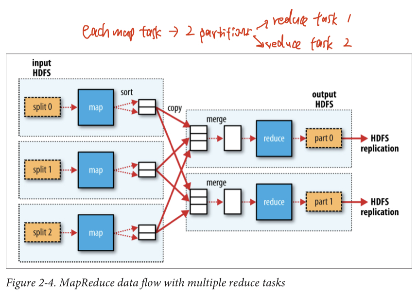
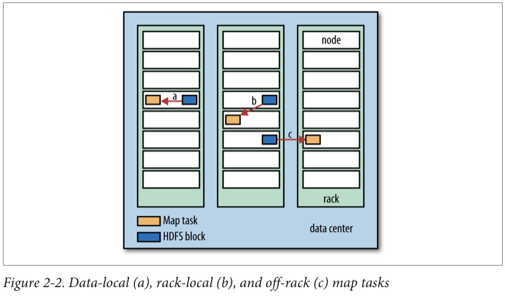

# Hadoop
## Motivation
### Problem
Data access rate can’t catch up with data storage capacity. So need to reduce disk IO time.
### Solution
**Read from many disks at once.** E.g., a job needs to read 100MB data, store this data in 100 disks, each storing 1MB and data for other jobs (i.e., shared).

**Data locality.** Make data access faster by co-locating data with compute nodes, so that don’t need to send data across network, which is expensive in data centres.

### Challenges
**Hardware failure.** The more disks you use, the higher the chance of having one failure). Can avoid via replication.

**How to combine data read from many disks.** Via MapReduce.

## MapReduce
* Processing model in Hadoop.
* Turns disk IO to computation over key-value pairs.
* Scales linearly with data size (because data is partitioned and processed in parallel).
### Workflow

**Map phase** 

* Hadoop creates one map task for each split (HDFS block, 128 MB). 
* Map task runs the user-defined map function on each record in the split, and writes intermediate result to disk instead of HDFS.
* Map task creates one partition for each reduce task. All records for given key are in the same partition.

**Data locality optimisation.** Hadoop tries to run the map task on a node that contains the input data split.

**Sort and group by key** 

* Hadoop processes map task results by sorting and grouping the key-value pairs by key.

**Combiner function**

* Optional.

* Does part of reducer’s work to cut down shuffling (e.g., in a MapReduce job to find maximum of given data, a combiner function can select the maximum from each map output before sending to reducer).

**Reduce phase**

* Get map task outputs (shuffle).
* Write result to HDFS (off-rack replica).
* Optional: If processing can be done entirely in parallel (e.g., select, filter), don’t need reduce task, and map tasks directly write to HDFS.
## Hadoop HDFS
**Distributed file system.** File systems that manage storage across a network of machines. Biggest challenge is to make it tolerate node failure without suffering data loss.
### Nodes

**Name node.** Master node.

* Manages file system namespace, maintains metadata for all files and directories in memory.
* Knows which data nodes contain blocks of a given file.
* Does not store block locations on disk; they are reconstructed from data nodes instead.
* Fault tolerance (prevent data loss but does not provide high availability - service is interrupted until a new name node is activated).
	* Backup files that store the file system metadata.
	* Secondary name node: Periodically merge the namespace image with the edit log.

**Data node.** Worker node.

* Store and retrieve blocks when told so by client or the name node.
* Report to name node on the blocks it stores.

**Small file issue.** The number of files in a file system is limited by its namenode memory. If there are a lot of small files in the file system, it needs a lot of name node memory to store their metadata.

**HDFS federation.** Name node memory is limiting factor for scaling. So HDFS federation allows a cluster to scale by adding name nodes, each managing a part of the file system namespace (e.g., /user, /shared).

### Block
**Disk block size.** Minimum amount of data a disk can read/write. E.g., 512 B.

**File system block size.** Multiples of disk block size, e.g., a few KBs for regular file system, 128 MB for HDFS.

HDFS uses larger block size to minimise cost of seeks (amount of time a disk drive's head takes to move to a specific location on a disk). If a block is large, when transferring a file made up of large blocks, time it takes to seek to the start of each block << time to transfer the block, so we don’t waste time in a lot of seeks.

**Replication factor.** Number of copies of each record in HDFS to provide fault tolerance. Typically 3.

**Block caching.** Frequently accessed files are cached in the data node’s memory, in an off-heap block cache.